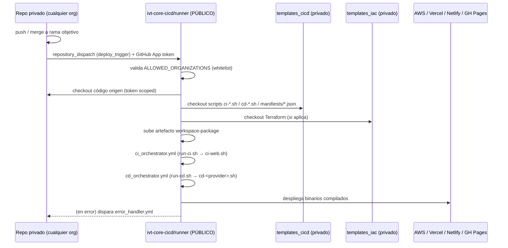

# Arquitectura del Orquestador CI/CD Central

Este documento describe el patrón de despliegue compartido por todas las organizaciones del ecosistema (`ivt-redcash`, `ivt-argos`, `ivt-hubs`, etc.). Cualquier repo nuevo que necesite CI/CD debe seguir este patrón — no se crean pipelines propios de build/deploy en repos privados.

Mantenido por el agente **CICD** (`.claude/agents/devops-cicd.md`).

---

## Objetivo: $0 de costo, siempre

- Los repos privados **nunca** compilan ni despliegan en su propio runner. Solo disparan un evento.
- Todo el trabajo pesado (checkout, build, deploy) corre en `ivt-core-cicd/runner`, que es **público**. GitHub no cobra minutos de Actions en repos públicos con runners hospedados (`ubuntu-latest`), sin importar cuánto dure el job.
- Los minutos de Actions se facturan **por organización** (cada org tiene su propia cuota gratuita, no se comparten ni se suman entre orgs), salvo que estén bajo un mismo GitHub Enterprise. Por eso mismo, aunque tengas 3 organizaciones, cada una parte de cero — pero de todos modos la meta es no gastar nada de esa cuota.

---

## Diagrama del flujo



---

## Contrato del payload (`client_payload`)

Este es el shape real que el repo consumidor debe enviar en el `repository_dispatch` (verificado contra `web-acash/.github/workflows/deploy.yml`):

```json
{
  "event_type": "deploy_trigger",
  "client_payload": {
    "component_name": "<nombre-del-repo>",
    "origin": {
      "owner": "<org-github>",
      "repo": "<org>/<repo>",
      "user": "<actor>",
      "env": "production | development",
      "ref": "<rama-o-tag>",
      "branch": "production | development",
      "prnumber": "<numero-o-0000>",
      "sha": "<commit-sha>"
    },
    "deploy": {
      "type": ["web", "mobile_android"],
      "providers": ["s3", "vercel", "netlify", "githubpage"],
      "stack": "react | angular | nextjs | react-native",
      "component": "s3",
      "component_name": "s3_<nombre-del-repo>",
      "node_version": "20.0.0"
    }
  }
}
```

`component_name` (nivel raíz) es la clave que se busca en `templates_cicd/manifiests/<org>.json` — debe coincidir exactamente con el nombre del repo tal como está registrado ahí.

---

## Matriz de soporte actual

| Capa | Soporta hoy | No soporta todavía |
|---|---|---|
| `ci-web.sh` (CI) | `react`, `react-native`, `nextjs` | **`angular`** — el `if` de stacks no lo contempla, el build no se ejecuta |
| `cd-*.sh` (CD) | `cd-aws-s3.sh`, `cd-vercel.sh`, `cd-netlify.sh`, `cd-githubpage.sh` | `lambda`, `api-gateway`, backend en general |
| `run-ci.sh` (tipos) | `web` | `mobile_android`, `mobile_ios`, `java`/`backend` (están comentados) |

**Implicación directa**: `mf-users-all` es Angular. Antes de onboardearlo al patrón central, `ci-web.sh` necesita una rama para `angular` (ejecutar `ng build` / el script `build-certi:single-spa:...` en vez de `npm run build`).

---

## Concurrencia

Cada `repository_dispatch` dispara una ejecución de workflow independiente (`run_id` propio) y GitHub las corre **en paralelo por defecto** — no hay encolamiento global. El único techo real es el límite de jobs concurrentes de la cuenta que es dueña de `runner` (Free: 20, Pro: 40, Team: 60, Enterprise: 180), muy por encima del volumen normal de un equipo pequeño.

`deploy.yml` define un `concurrency.group` scopeado por `component_name` + `origin.env`:

```yaml
concurrency:
  group: deploy-${{ github.event.client_payload.component_name }}-${{ github.event.client_payload.origin.env }}
  cancel-in-progress: true
```

Esto evita la única condición de carrera real del sistema: dos pushes rápidos al **mismo** repo/ambiente ya no compiten por escribir al mismo destino (S3/Vercel/etc.) en un orden no determinístico — el deploy viejo se cancela y gana siempre el más reciente. Deploys de componentes, repos u organizaciones distintos siguen corriendo en paralelo sin restricción, porque cada uno cae en un `group` distinto.

---

## Bugs conocidos en `templates_cicd` (pendientes, no corregidos aún)

1. **`cd-aws-s3.sh` lee `.origin_org`**, pero el payload real solo trae el owner anidado en `.origin.owner`. Con el contrato actual, `ORGANIZATION` resuelve a `null` y `MANIFEST_FILE` apunta a un archivo inexistente (`manifests/null.json`) — el script fallaría por `set -e` al intentar leer un manifest que no existe.
2. **Typo de carpeta**: `cd-aws-s3.sh` busca `../templates-cicd/manifests/` (sin la "i"), pero la carpeta real en el repo es `templates_cicd/manifiests/` (con la "i"). Aunque se arregle el punto 1, la ruta seguiría sin encontrar el archivo.

Estos dos bugs bloquean cualquier despliegue real a S3 a través del orquestador central tal como está hoy. Deben corregirse antes de onboardear `mf-users-all` u otro repo que use `cd-aws-s3.sh`.

---

## Checklist de onboarding para un repo nuevo

1. ¿El `stack` del repo está soportado en `ci-web.sh` (o el `ci-*.sh` correspondiente)? Si no, agregarlo sin romper los existentes.
2. ¿El `provider` de destino tiene su `cd-<provider>.sh`? Si no, crearlo siguiendo el mismo contrato de argumentos (`JSON_PATH`, `ENV_TARGET`, `STACK`).
3. Registrar el componente en `templates_cicd/manifiests/<org>.json` con su configuración real de destino (bucket, folder, project id, etc.).
4. Confirmar que la org está en la variable `ALLOWED_ORGANIZATIONS` del repo `runner`.
5. Reemplazar el workflow del repo privado por el patrón "dispatch and forget" (ver `web-acash/.github/workflows/deploy.yml` como referencia) — nunca dejar build/deploy corriendo en el repo privado.
6. Actualizar este documento si el onboarding introdujo un stack, provider o tipo nuevo.

---

## Seguridad

- El repo `runner` es público, pero solo reacciona a `repository_dispatch` (nunca a `pull_request` de forks), y valida la whitelist `ALLOWED_ORGANIZATIONS` antes de hacer nada.
- La autenticación entre repos/orgs se hace con una GitHub App (`APP_ID` / `APP_PRIVATE_KEY`), generando tokens temporales con scope limitado al repo/organización específica — nunca se usa un PAT de acceso amplio.
- El código de `templates_cicd` y `templates_iac` es privado; el repo público solo expone la orquestación, no la lógica de despliegue en sí.
